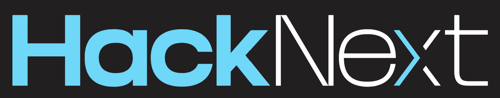
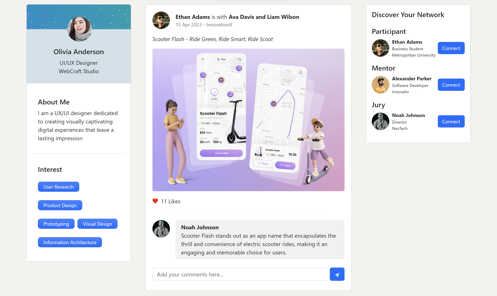
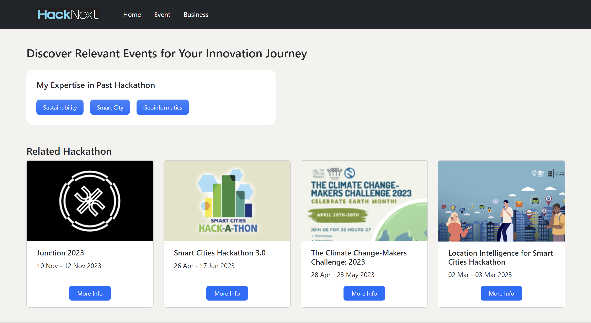
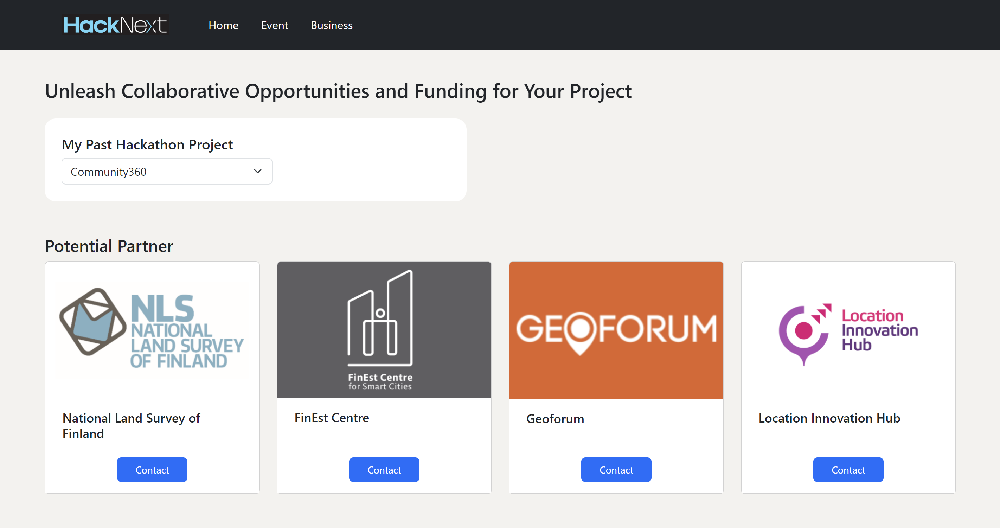

# 

HackNext is an interactive web platform that brings together participants, partners, and organizers, facilitating seamless post-hackathon development.

This platform enables participants to showcase their hackathon projects, engage through reactions and comments, creating a social media-like experience curated specifically for hackathons. Also, HackNext offers personalized recommendations for upcoming hackathons and events tailored to participants' interests and skill sets, and facilitates the search for potential partners and funding essential to kickstarting participants' business.

## 👉🏼 Demo

🌐 [Live Demo](https://wengcychan.github.io/hacknext/) : HackNext's Website

▶️ [Watch the Video](https://youtu.be/dKqXNFNgngc) : HackNext's design inspiration, key features and the impact it can bring

## 📸 Screenshots

 
 

 
 

## 🛠️ Technologies Used

- React
- TypeScript
- HTML
- CSS
- Bootstrap

## 🚀 Installation

1. Clone the repository
2. Install dependencies with `npm install`
3. Run the development server with `npm run dev`
